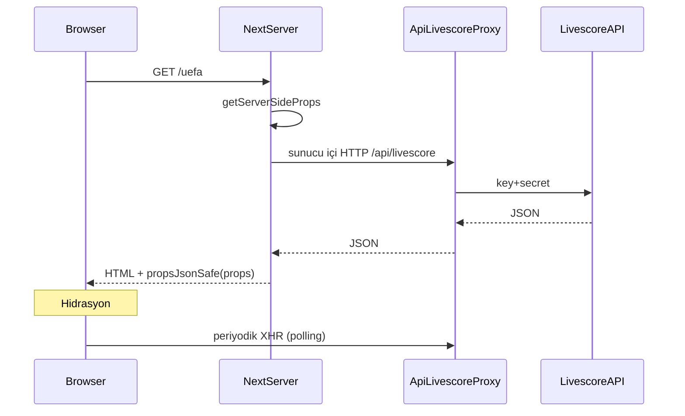

# SSR ve önbellek (cache) mimarisi

Bu doküman, Ofsayt Yok projesinde **sunucu tarafında ilk veri yükleme** (`getServerSideProps`) ile **istemci tarafında güncelleme** (polling, sekme değişimi vb.) birlikte nasıl kullanıldığını ve **HTTP önbelleğinin** nerede devreye girdiğini özetler.

## Genel fikir

1. **İlk istek:** Tarayıcı sayfayı ister → Next.js sunucuda `getServerSideProps` çalışır → veri toplanır → HTML ve sayfa props’u üretilir → kullanıcı mümkün olduğunca **dolu içerik** görür.
2. **Sonrası:** Aynı sayfada canlı skor, tarih/lig değişimi, sekmeler gibi ihtiyaçlar **tarayıcıdan** mevcut `liveScoreService` / `fetch` akışlarıyla devam eder (ör. 30 saniyede bir yenileme).

Böylece hem **ilk boya (FCP)** iyileşir hem de **dinamik veri** davranışı bozulmaz.



## Sunucuda Livescore nasıl çağrılıyor?

Tarayıcıda `liveScoreService` varsayılan olarak **`/api/livescore`** tabanlı axios kullanır (relative URL).

Sunucuda `getServerSideProps` içinde relative URL güvenilir olmadığı için:

- **`livescoreInternalAxios`** — İstek başına `x-forwarded-proto` ve `Host` ile `https://siteniz/api/livescore` tabanlı bir axios örneği oluşturur.
- **`liveScoreHttpContext`** — `runWithLiveScoreHttpClient(axiosInstance, fn)` ile bu axios’u **yalnızca o SSR isteği süresince** `liveScoreService`’e bağlar. Tarayıcıda `AsyncLocalStorage` kullanılmaz; çakışma riski olmaz.

Loader dosyaları (`src/server/load*.ts`) genelde şu kalıbı izler:

```ts
const client = livescoreAxiosFromIncomingMessage(req);
return await runWithLiveScoreHttpClient(client, async () => {
  // getAllLiveMatches(), getCompetitionTableFull(), …
});
```

Haber tarafında bazı sayfalar doğrudan **`getCachedNews()`** (RSS önbelleği) kullanır; ekstra HTTP atmadan API route ile aynı veriyi alır.

## Props’ta `undefined` yasağı ve `propsJsonSafe`

Next.js, `getServerSideProps` dönüşünü **JSON** ile serileştirir. Obje içinde **`undefined` değerli alanlar** hataya yol açar.

**[`src/server/propsJsonSafe.ts`](src/server/propsJsonSafe.ts)** tüm kritik GSSP çıktılarında kullanılır:

```ts
propsJsonSafe(payload); // JSON.parse(JSON.stringify(payload))
```

Böylece iç içe `undefined` anahtarlar temizlenir. Ek olarak, örneğin fikstür normalleştirmesinde isteğe bağlı alanlar mümkünse hiç eklenmez (`normalizeFixtureToMatch`).

## Hangi sayfalarda SSR var?

| Rota | Özet veri paketi |
|------|------------------|
| `/` | Seçili gün + varsayılan lig: maçlar, canlı, fikstür, puan durumu, gol krallığı |
| `/uefa` | Varsayılan UEFA ligi için canlı, fikstür, geçmiş, puan, gol krallığı |
| `/standings` | Tablo, gol krallığı, kartlar |
| `/matches/[id]` | Maç + olaylar + kadrolar + istatistik + lig tablosu (varsa) |
| `/teams/[id]` | Son maçlar, ilk lig kadrosu + mini puan tablosu |
| `/news/[id]` | Makale + yan haber listesi (`getCachedNews`) |
| `/world-cup` | Bootstrap: sezonlar, ana tablo, varsayılan grup seçimi (Maçlar sekmesi ağır veri hâlâ client) |
| `/profile` | Oturum varsa Prisma’dan profil alanı (oturum yoksa redirect) |

Auth formları (`/auth/signin`, `/auth/signup`) bilinçli olarak SSR veri paketi olmadan bırakılmıştır.

## İstemcide “çift fetch”i önleme (hidrasyon)

SSR ile gelen props zaten state’e yazıldığı için, ilk `useEffect` turunda **aynı veriyi tekrar çekmemek** için `useRef` bayrakları kullanılır:

- **`MatchHubPage`:** `uefaMatches` / `uefaStandings` (UEFA) ve `defaultMatches` / `defaultStandings` (ana sayfa); tarih veya lig değişince normal fetch devam eder.
- **Maç / takım / profil / dünya kupası:** İlk tur atlanır; `matchId` / `teamId` değişince veya kullanıcı etkileşimiyle yeniden fetch çalışır.

Periyodik **30 sn interval** (maç hub) ve diğer client effect’ler aynen korunur.

## Cache-Control politikası

Önbellek **iki seviyede** düşünülebilir:

### 1. Sayfa yanıtı (CDN / edge)

`getServerSideProps` içinde `ctx.res.setHeader('Cache-Control', ...)` ile Vercel (veya benzeri) edge’de HTML/props JSON’u kısa süre önbelleğe alınabilir.

| Örnek kullanım | Tipik değer | Açıklama |
|----------------|-------------|----------|
| Genel spor sayfaları | `public, s-maxage=30, stale-while-revalidate=120` | Edge ~30 sn tutar; süre dolunca arka planda tazeler. |
| Puan / haber biraz daha “yavaş” | `public, s-maxage=60` … | Biraz daha uzun edge TTL. |
| **Profil** | `private, no-store` | Kişisel veri; paylaşımlı CDN önbelleğine uygun değildir. |

`stale-while-revalidate`: süresi dolmuş önbellek yanıtı verilirken arka planda yeni içerik çekilir; kullanıcı bekletilmez (TTL seçimine bağlı tazelik).

### 2. Upstream API (`/api/livescore`)

Proxy dosyası ([`src/pages/api/livescore/[...path].ts`](src/pages/api/livescore/[...path].ts)) kendi içinde ek `Cache-Control` set etmiyorsa, tarayıcı önbelleği varsayılan davranışla kalır. İleride **tablo** vs **canlı** endpoint’leri için farklı `Cache-Control` eklemek mümkündür (canlı: kısa veya `no-store`).

## Geliştirme notları

- **Sunucu–sunucu self-fetch:** SSR loader’ları kendi origin’inize (`/api/livescore`) gider; kimlik bilgileri yine proxy’de env ile kalır.
- **Hata durumu:** Loader `null` dönerse sayfalar mümkün olduğunca eski client-only davranışa yakın fallback kullanır (ör. boş tablo, client bootstrap).
- **Dünya Kupası:** İlk boyayı hafifletmek için yalnızca bootstrap SSR’da; **Maçlar** sekmesindeki çoklu grup istekleri bilinçli olarak istemcide bırakılmıştır (TTFB ve kota).

## İlgili dosyalar (hızlı referans)

| Dosya | Rol |
|-------|-----|
| [`src/server/propsJsonSafe.ts`](src/server/propsJsonSafe.ts) | Props JSON güvenliği |
| [`src/server/livescoreInternalAxios.ts`](src/server/livescoreInternalAxios.ts) | SSR axios tabanı |
| [`src/services/liveScoreHttpContext.ts`](src/services/liveScoreHttpContext.ts) | İstek kapsamlı HTTP client |
| [`src/server/load*.ts`](src/server/) | Sayfa başına veri toplama |
| [`src/components/MatchHubPage/index.tsx`](src/components/MatchHubPage/index.tsx) | Hub hidrasyon + skip ref’leri |
| Sayfa dosyaları `src/pages/**` | `getServerSideProps` + `Cache-Control` |

Bu mimari, **SEO ve ilk yükleme kalitesi** ile **canlı güncellenebilir UI** arasında bilinçli bir denge kurar; cache sürelerini trafik ve API limitlerine göre `getServerSideProps` içinde tek yerden güncellemek yeterlidir.
