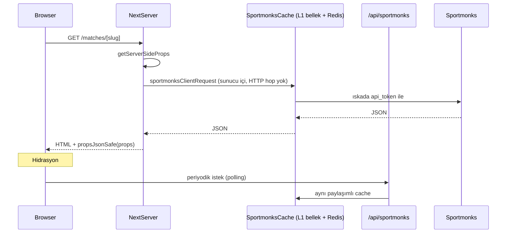

# SSR ve önbellek (cache) mimarisi

Bu doküman, Ofsayt Yok projesinde **sunucu tarafında ilk veri yükleme** (`getServerSideProps`) ile **istemci tarafında güncelleme** (polling, sekme değişimi vb.) birlikte nasıl kullanıldığını ve **HTTP önbelleğinin** nerede devreye girdiğini özetler.

## Genel fikir

1. **İlk istek:** Tarayıcı sayfayı ister → Next.js sunucuda `getServerSideProps` çalışır → veri toplanır → HTML ve sayfa props’u üretilir → kullanıcı mümkün olduğunca **dolu içerik** görür.
2. **Sonrası:** Aynı sayfada canlı skor, tarih/lig değişimi, sekmeler gibi ihtiyaçlar **tarayıcıdan** mevcut `liveScoreService` / `fetch` akışlarıyla devam eder (ör. 30 saniyede bir yenileme).

Böylece hem **ilk boya (FCP)** iyileşir hem de **dinamik veri** davranışı bozulmaz.


```mermaid
sequenceDiagram
  participant Browser
  participant Next as NextServer
  participant Cache as SportmonksCache (L1 bellek + Redis)
  participant Proxy as /api/sportmonks
  participant Upstream as Sportmonks

  Browser->>Next: GET /matches/[slug]
  Next->>Next: getServerSideProps
  Next->>Cache: sportmonksClientRequest (sunucu içi, HTTP hop yok)
  Cache->>Upstream: ıskada api_token ile
  Upstream-->>Cache: JSON
  Cache-->>Next: JSON
  Next-->>Browser: HTML + propsJsonSafe(props)
  Note over Browser: Hidrasyon
  Browser->>Proxy: periyodik istek (polling)
  Proxy->>Cache: aynı paylaşımlı cache
```

## Sunucuda maç verisi nasıl çağrılıyor?

Tek veri sağlayıcı **Sportmonks** (eski livescore-api.com yolu, `/api/livescore` proxy'si ve ona bağlı axios /
`AsyncLocalStorage` istemcileri 2026-10-02'de kaldırıldı). `liveScoreService` fonksiyonları sunucuda ve tarayıcıda
aynıdır; yönlendirmeyi [`sportmonksRuntimeClient.ts`](src/services/sportmonksRuntimeClient.ts) yapar:

- **Sunucuda** (SSR, API route, cron, bot): istek doğrudan paylaşımlı cache'ten geçer
  ([`server/sportmonks/cachedFetch.ts`](src/server/sportmonks/cachedFetch.ts) — L1 bellek + Redis L2, TTL'ler
  [`cachePolicy.ts`](src/services/sportmonks/cachePolicy.ts)). Kendi origin'ine HTTP isteği atılmaz, sarmalayıcı gerekmez.
- **Tarayıcıda**: [`/api/sportmonks/[...path]`](src/pages/api/sportmonks/[...path].ts) proxy'si (izin listesi:
  [`proxyAllowlist.ts`](src/server/sportmonks/proxyAllowlist.ts)); token yalnız sunucuda, aynı cache'i kullanır.

Loader'lar (`src/server/*.ts`) `liveScoreService` fonksiyonlarını doğrudan çağırır; süre logu için `timedSsrLoad`
([`ssrTiming.ts`](src/server/ssrTiming.ts)).

Haber tarafında bazı sayfalar doğrudan **`getCachedNews()`** (RSS önbelleği) kullanır; ekstra HTTP atmadan API route ile aynı veriyi alır.

## Props’ta `undefined` yasağı ve `propsJsonSafe`

Next.js, `getServerSideProps` dönüşünü **JSON** ile serileştirir. Obje içinde **`undefined` değerli alanlar** hataya yol açar.

**[`src/server/propsJsonSafe.ts`](src/server/propsJsonSafe.ts)** tüm kritik GSSP çıktılarında kullanılır:

```ts
propsJsonSafe(payload); // JSON.parse(JSON.stringify(payload))
```

Böylece iç içe `undefined` anahtarlar temizlenir. Ek olarak mapper'lar isteğe bağlı alanları mümkünse hiç eklemez (`sportmonksFixtureMapper`).

## Hangi sayfalarda SSR var?

| Rota | Özet veri paketi |
|------|------------------|
| `/` | Seçili gün + varsayılan lig: maçlar, canlı, fikstür, puan durumu, gol krallığı |
| `/uefa` | Varsayılan UEFA ligi için canlı, fikstür, geçmiş, puan, gol krallığı |
| `/standings` | Tablo, gol krallığı, kartlar |
| `/matches/[id]` | Maç + olaylar + kadrolar + istatistik + lig tablosu (varsa) |
| `/teams/[id]` | Son maçlar, ilk lig kadrosu + mini puan tablosu |
| `/news/[id]` | Makale + yan haber listesi (`getCachedNews`) |
| `/world-cup` | Şimdilik kapalı: ana sayfaya 302 (`WORLD_CUP_PAGE_ENABLED`, Dünya Kupası Sportmonks planında yok) |
| `/profile` | Oturum varsa Prisma’dan profil alanı (oturum yoksa redirect) |

Auth formları (`/auth/signin`, `/auth/signup`) bilinçli olarak SSR veri paketi olmadan bırakılmıştır.

## İstemcide “çift fetch”i önleme (hidrasyon)

SSR ile gelen props zaten state’e yazıldığı için, ilk `useEffect` turunda **aynı veriyi tekrar çekmemek** için `useRef` bayrakları kullanılır:

- **`MatchHubPage`:** `uefaMatches` / `uefaStandings` (UEFA) ve `defaultMatches` / `defaultStandings` (ana sayfa); tarih veya lig değişince normal fetch devam eder.
- **Maç / takım / profil / dünya kupası:** İlk tur atlanır; `matchId` / `teamId` değişince veya kullanıcı etkileşimiyle yeniden fetch çalışır.

Periyodik **30 sn interval** (maç hub) ve diğer client effect’ler aynen korunur.

## Cache-Control politikası

Önbellek **iki seviyede** düşünülebilir:

### 1. Sayfa yanıtı (CDN / edge)

`getServerSideProps` içinde `ctx.res.setHeader('Cache-Control', ...)` ile Vercel (veya benzeri) edge’de HTML/props JSON’u kısa süre önbelleğe alınabilir.

| Örnek kullanım | Tipik değer | Açıklama |
|----------------|-------------|----------|
| Genel spor sayfaları | `public, s-maxage=30, stale-while-revalidate=120` | Edge ~30 sn tutar; süre dolunca arka planda tazeler. |
| Puan / haber biraz daha “yavaş” | `public, s-maxage=60` … | Biraz daha uzun edge TTL. |
| **Profil** | `private, no-store` | Kişisel veri; paylaşımlı CDN önbelleğine uygun değildir. |

`stale-while-revalidate`: süresi dolmuş önbellek yanıtı verilirken arka planda yeni içerik çekilir; kullanıcı bekletilmez (TTL seçimine bağlı tazelik).

### 2. Sağlayıcı verisi (Sportmonks cache)

Sunucu ve `/api/sportmonks` proxy'si aynı cache'i kullanır; süreler uç noktaya ve maçın durumuna göre
[`cachePolicy.ts`](src/services/sportmonks/cachePolicy.ts)'te. Maç sayfası HTML'inin CDN süresi
[`matchPageCache.ts`](src/server/matchPageCache.ts)'te (canlı 20 sn … bitmiş 1 gün; form / karşılaşma geçmişi SSR
bütçesini aşarsa 30 sn).

## Geliştirme notları

- **Self-fetch yok:** SSR loader'ları Sportmonks'a paylaşımlı cache üzerinden süreç içinde gider; `SPORTMONKS_API_KEY` yalnız sunucuda.
- **Hata durumu:** Loader `null` dönerse sayfalar mümkün olduğunca eski client-only davranışa yakın fallback kullanır (ör. boş tablo, client bootstrap).
- **Dünya Kupası:** Sayfa şimdilik kapalı (302); kodu duruyor (`src/pages/world-cup`).

## İlgili dosyalar (hızlı referans)

| Dosya | Rol |
|-------|-----|
| [`src/server/propsJsonSafe.ts`](src/server/propsJsonSafe.ts) | Props JSON güvenliği |
| [`src/services/sportmonksRuntimeClient.ts`](src/services/sportmonksRuntimeClient.ts) | Sunucu (cache) / tarayıcı (proxy) yönlendirmesi |
| [`src/server/sportmonks/cachedFetch.ts`](src/server/sportmonks/cachedFetch.ts) | Paylaşımlı Sportmonks cache'i (L1 + Redis) |
| [`src/server/load*.ts`](src/server/) | Sayfa başına veri toplama |
| [`src/components/MatchHubPage/index.tsx`](src/components/MatchHubPage/index.tsx) | Hub hidrasyon + skip ref’leri |
| Sayfa dosyaları `src/pages/**` | `getServerSideProps` + `Cache-Control` |

Bu mimari, **SEO ve ilk yükleme kalitesi** ile **canlı güncellenebilir UI** arasında bilinçli bir denge kurar; cache sürelerini trafik ve API limitlerine göre `getServerSideProps` içinde tek yerden güncellemek yeterlidir.
